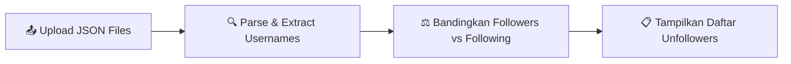

<div align="center">

<!-- HEADER BANNER -->


<br/>

<!-- BADGES -->
<p>
  
  
  
  
</p>

<p>
  
  &nbsp;
  
</p>

<br/>

> **Aplikasi web ringan & privat untuk menganalisis data export Instagram** — cari tahu siapa saja yang tidak follow back, tanpa perlu login atau API key. 100% aman, semua diproses lokal.

<br/>

</div>

---

## 📸 Preview

<div align="center">
<i>Screenshot aplikasi akan tampil di sini — tambahkan gambar demo kamu!</i>

<!-- Ganti dengan screenshot asli kamu -->
<!--  -->
</div>

---

## ✨ Fitur Unggulan

<table>
<tr>
<td width="50%">

**📤 Upload & Analisis**
Upload `followers_1.json` dan `following.json` dari data export resmi Instagram, lalu biarkan aplikasi bekerja secara otomatis.

**🔎 Deteksi Unfollowers**
Algoritma perbandingan cepat untuk menemukan akun yang kamu follow tapi tidak follow back.

**📊 Statistik Lengkap**
Lihat total followers, following, dan jumlah unfollowers sekaligus dalam satu tampilan.

</td>
<td width="50%">

**🔗 Direct Profile Link**
Klik nama username langsung menuju profil Instagram mereka — tanpa copy-paste manual.

**🔍 Search & Filter**
Cari username spesifik dari daftar unfollowers dengan fitur pencarian real-time.

**🌙 Dark Mode UI**
Tampilan modern bertema gelap yang terinspirasi dari estetika Instagram, responsif di semua perangkat.

</td>
</tr>
</table>

---

## 🛠️ Tech Stack

| Teknologi | Fungsi |
|:---------:|:-------|
|  | Backend logic & data processing |
|  | Web framework ringan |
|  | UI framework & komponen |
|  | Ikon antarmuka |
|  | Frontend rendering |

---

## 📁 Struktur Project

```
instagram-unfollow-checker/
│
├── 📄 app.py                 # Main Flask application & routing
├── 📋 requirements.txt       # Python dependencies
├── 🚫 .gitignore             # Git ignore rules
│
└── 📂 templates/
    └── 🌐 index.html         # Halaman utama (UI dark mode)
```

---

## 🚀 Instalasi & Cara Menjalankan

### 1. Clone Repository

```bash
git clone https://github.com/rivaelsaputra107387/instagram-unfollow-checker.git
cd instagram-unfollow-checker
```

### 2. Install Dependencies

```bash
pip install -r requirements.txt
```

### 3. Jalankan Aplikasi

```bash
python app.py
```

### 4. Buka di Browser

```
http://127.0.0.1:5000
```

> 💡 **Tip:** Pastikan kamu menggunakan Python 3.7 atau lebih baru.

---

## 📥 Cara Mendapatkan Data Export Instagram

Ikuti langkah-langkah berikut untuk mengunduh data dari akun Instagrammu:

```
1. Buka Instagram → ⚙️ Settings → Your Activity
2. Pilih "Download Your Information"
3. Pilih format: JSON
4. Tunggu email dari Instagram berisi link download
5. Extract file ZIP
6. Cari di folder followers_and_following/:
   ├── followers_1.json    ← file ini
   └── following.json      ← dan ini
7. Upload keduanya ke aplikasi ✅
```

---

## ⚙️ Cara Kerja



| Tahap | Proses |
|:-----:|:-------|
| **Upload** | User mengupload `followers_1.json` dan `following.json` |
| **Parsing** | Aplikasi mem-parsing JSON sesuai struktur export Instagram terbaru |
| **Comparing** | Membandingkan set `following` dengan set `followers` |
| **Result** | Menampilkan daftar akun yang di-follow tapi tidak follow back |

---

## 🔑 Referensi Fungsi Utama

<details>
<summary><b><code>extract_usernames(data)</code></b> — Parsing followers_1.json</summary>

```python
# Struktur: array of objects
# Username diambil dari: string_list_data[0].value

def extract_usernames(data):
    usernames = set()
    for item in data:
        username = item["string_list_data"][0]["value"]
        usernames.add(username)
    return usernames
```

</details>

<details>
<summary><b><code>extract_following_usernames(data)</code></b> — Parsing following.json</summary>

```python
# Struktur: object dengan key "relationships_following"
# Username diambil dari: title

def extract_following_usernames(data):
    usernames = set()
    for item in data["relationships_following"]:
        username = item["title"]
        usernames.add(username)
    return usernames
```

</details>

---

## 🔒 Privasi & Keamanan

<div align="center">

| ✅ Yang Terjadi | ❌ Yang TIDAK Terjadi |
|:---|:---|
| Data diproses di memory lokal | Data **tidak** dikirim ke server manapun |
| File JSON dibaca sementara | File **tidak** disimpan permanen |
| Proses 100% di mesinmu sendiri | **Tidak** ada database yang terlibat |
| Hasil langsung tampil di browser | **Tidak** ada akun Instagram yang diakses |

</div>

> **Aplikasi ini sepenuhnya aman.** Tidak ada koneksi ke Instagram API, tidak ada penyimpanan data, dan tidak ada autentikasi yang diperlukan.

---

## 🤝 Contributing

Kontribusi sangat diterima dan dihargai! Berikut cara berkontribusi:

1. **Fork** repository ini
2. **Buat branch** baru → `git checkout -b feature/nama-fitur`
3. **Commit** perubahan → `git commit -m 'feat: menambahkan fitur baru'`
4. **Push** ke branch → `git push origin feature/nama-fitur`
5. **Buat Pull Request** dan jelaskan perubahannya

Untuk perubahan besar, buka **Issue** terlebih dahulu untuk diskusi.

---

## 📄 Lisensi

Didistribusikan di bawah lisensi **MIT**. Lihat [`LICENSE`](LICENSE) untuk informasi lebih lanjut.

Bebas digunakan, dimodifikasi, dan didistribusikan — dengan tetap mencantumkan atribusi.

---

<div align="center">


**Dibuat dengan ❤️ menggunakan Flask & Bootstrap**

Jika project ini bermanfaat bagimu, pertimbangkan untuk memberikan ⭐ **Star** di repository ini!

<br/>

[](https://instagram.com/rievaelss)
[](https://github.com/rivaelsaputra107387)

</div>
